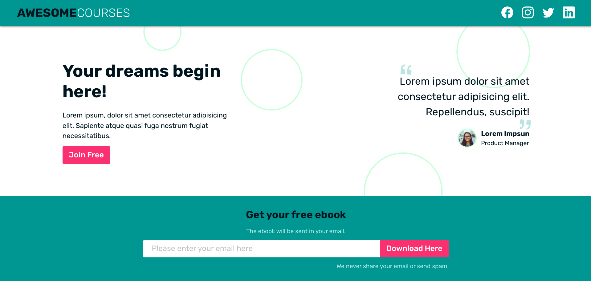

## Website: Lead Capture Page

This project was created to be part of my portfolio. The page is a representation of a lead capture page built to be functional and responsive.

Created with accessibility resources, keyboard navigation and a great result with screen readers, this is what I believe is one of the most important things to pay attention to when creating a webpage nowadays.

The layout was built with SEO in mind, semantic HTML and advanced CSS skills and project organization. Everything is optimized and written in a clean way to be easily maintainable in the future.

[Check it out](https://feliperdamaceno.github.io/lead-capture-page/)

## Licence

This repository is released under the [**MIT License**](LICENSE).

## From me to you

Hi, my name is **Felipe!**

I'm a Front-End student who wants to share my learning with the community, helping other devs in the same situation.

At the moment I'm studying by myself in 💻 online courses, 📄 reading the documentation, and 💪 hard practicing every day. So if I can, **you could too!**

I hope you've enjoyed this repository and have helped you in some way.

Thanks for checking out and have good learning 😉"

## Contributors

[feliperdamaceno](https://github.com/feliperdamaceno/)

## Contact me

Linkedin: [feliperdamaceno](https://www.linkedin.com/in/feliperdamaceno/)
